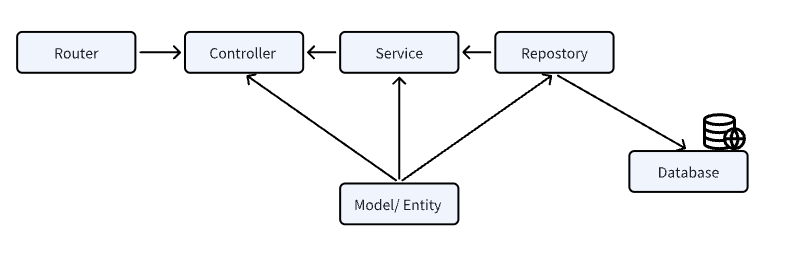

## Bước 1: tìm hiểu tổng quan

- Đọc tài liệu chính thống của go
- Lướt một vòng github đọc qua các opensource

## Bước 2: tìm sách tốt

1. Pro Go: The Complete Guide to Programming Reliable and Efficient Software Using Golang - Adam Freeman
2. Software Development with Go: Cloud-Native Programming using Golang with Linux and Docker - Nanik Tolaram
3. Go Programming - From Beginner to Professional - Packt Publishing
4. Hands-On High Performance with Go - Packt Publishing
5. gRPC Microservices in Go - HÜSEYIN BABAL

## Bước 3: tìm hiểu kiến thức từ những người đi trước có kinh nghiệm, học được từ anh anonystick https://www.youtube.com/@anonystick

Dưới đây là những gì đọng lại sau khi xem video:

Thiết lập dự án go  
Video 1

1. Tạo một dự án mới:

- go mod init ten_du_an

2. Xây dựng thư mục

- cmd
  - cli
  - cronjob
  - server - chứa thư mục khởi tạo dự án.
- internal - mã cục bộ của dự án
  - controller
  - models
  - service
  - repo - dto
  - router
  - middleware
  - initialize - khởi tạo database
- pkg
  - utils
  - setting
  - logger
- docs - lưu trữ tài liệu nội bộ
- tests
- third_party - nếu có
- scripts - các file bash chạy kịch bản
- migrations - lưu trữ các file sql để khởi tạo db
- response - tạo ra các file quản trị những thông tin trả về
- global - lưu trữ file dùng chung toàn dự án
- configs - cài đặt cho dự án

- .gitignore
- go.mod file thông tin dự án

---

video 2
Lựa chọn gin là framework.

1. Chuẩn bị

- Tải thư viện: https://github.com/gin-gonic/gin
- go get -u github.com/gin-gonic/gin

sau đó go sẽ tự động tải về một loạt các thư viện, có thể kiểm tra ở file go.mod

go tự động tạo cho ta file go.sum đơn giản là ghi log nhật ký tải thôi.

Quay lại trang github của git, copy tạm một demo của gin.

```go
package main

import (
	"net/http"

	"github.com/gin-gonic/gin"
)

func main() {
  r := gin.Default()
  r.GET("/ping", func(c *gin.Context) {
    c.JSON(http.StatusOK, gin.H{
      "message": "pong",
    })
  })
  r.Run() // listen and serve on 0.0.0.0:8080 (for windows "localhost:8080")
  // r.Run(":9999") sửa port ở đây
}
```

Tìm hiểu một chút:

- r := gin.Default() giữ control và click vào ta sẽ thấy hàm này khởi tạo sẵn cho ta logger và recovery.

Khởi tạo một handler:

```go

func main() {
  r := gin.Default()
  r.GET("/ping", Pong)
  r.Run()
}

//Tạo một handler

func Pong (c *gin.Context) {
	c.JSON(http.StatusOK, gin.H{
		"message": "pong",
	})
}

```

Tạo nhóm api

```go

func main() {
  r := gin.Default()

	//tạo nhóm api
	v1 := r.Group("/v1")
	{
		v1.GET("/ping", Pong)
		v1.GET("/hello", Pong)
		v1.POST("/ping", Pong)
		v1.PATCH("/ping", Pong)
		v1.PUT("/ping", Pong)
		v1.DELETE("/ping", Pong)
		v1.HEAD("/ping", Pong)
		v1.OPTIONS("/ping", Pong)
	}

  r.GET("/ping", Pong)
  r.Run()
}
```

Tạo ra file routers.go trong thư mục routers. Chuyển routers qua bên file đó. Lưu ý vấn đề: chỉ chữ hoa mới được export

```go
//routers/routers.go
package routers

import (
	"net/http"

	"github.com/gin-gonic/gin"
)

func NewRouter() *gin.Engine {
	r := gin.Default()
	v1 := r.Group("/v1")
	{
		v1.GET("/ping", Pong)
		v1.GET("/hello", Pong)
		v1.POST("/ping", Pong)
		v1.PATCH("/ping", Pong)
		v1.PUT("/ping", Pong)
		v1.DELETE("/ping", Pong)
		v1.HEAD("/ping", Pong)
		v1.OPTIONS("/ping", Pong)
	}
	return r
}

func Pong (c *gin.Context) {
	c.JSON(http.StatusOK, gin.H{
		"message": "pong",
		"users":[]string{
			"1",
			"2",
			"3",
		 },
	})
}


//cmd/server/main.go
package main

import (
	"go-tip/internal/routers"
)

func main() {
  r := routers.NewRouter()

  r.Run()
}

```

Tạo file tests/test.http để tạo một http resquest hoặc sử dụng cmd: curl http://localhost:8080/v1/ping

nếu tạo file thì nhớ cài extension http rest, file có nội dung như sau:

```http
GET  http://localhost:8080/v1/ping
```

Video 3: Hướng dẫn xây dựng api theo mô hình mvc

Yêu cầu: phải hiểu con trỏ, struct. (Học kỹ sau này)
controller -> service -> repo -> models -> db


Tips: mình có thể alias cho đường dẫn.

```go

import (
	c "go-tip/internal/controller"
	"net/http"

	"github.com/gin-gonic/gin"
)

func NewRouter() *gin.Engine {
	r := gin.Default()
	v1 := r.Group("/v1")
	{
		v1.GET("/ping", Pong)
		v1.GET("/user", c.NewUserController(r).GetUser)
	}
	return r
}

```

c ở đây thay thế cho controller

Xong bước 1: tạo controller với struct.
Bước hai đi tạo các lớp liên quan, controller sẽ gọi đến service, service gọi đến repo, repo gọi đến db quá là quen thuộc!

---

Video 4: error handler

- liệt kê lỗi trong file httpStatusCode
- Viết sẵn các hàm handle lỗi trong file response.go

Demo SuccessResponse

```go
func (uc *UserController) GetUser(c *gin.Context) {
	// c.JSON(http.StatusOK, gin.H{
	// 	"Duy": uc.userService.GetUser(),
	// })

	response.SuccessResponse(c, http.StatusOK, uc.userService.GetUser())
}
```

Demo ErrorResponse

```go
func (uc *UserController) GetUser(c *gin.Context) {
	// c.JSON(http.StatusOK, gin.H{
	// 	"Duy": uc.userService.GetUser(),
	// })

	response.ErrorResponse(c, http.StatusNotFound, uc.userService.GetUser())
}
```

Vì mỗi lần sửa lại file thì đều phải chạy lại server quá là điên tiết, vì bị nhiễm sự tiện lợi của nodejs khi mỗi lần chỉnh sửa nó tự watch và compile lại cho mình, vì thế nên đã tìm hiểu thêm vài thư viện liên quan đến live-reloading và thật may mắn khi tìm thấy air. Vào thẳng https://github.com/air-verse/air để đọc cho chi tiết.

```bash
go install github.com/air-verse/air@latest
```

Tải air về xong cần config

````bash
air init
```
sau đó thì cần chỉnh sửa lại file .air.toml một chút cho phù hợp
``` bash
[build]
# Thực hiện lệnh build cho thư mục chứa main.go
cmd = "go build -o ./tmp/main.exe ./cmd/server"
# File binary sẽ được lưu ở đâu
bin = "./tmp/main.exe"
# Tự động chạy lại sau khi build thành công
full_bin = "D:/2024-go/tmp/main.exe"
````

Giờ thì sửa file xong chỉ cần ctrl+s thôi, không khác gì nodemon
